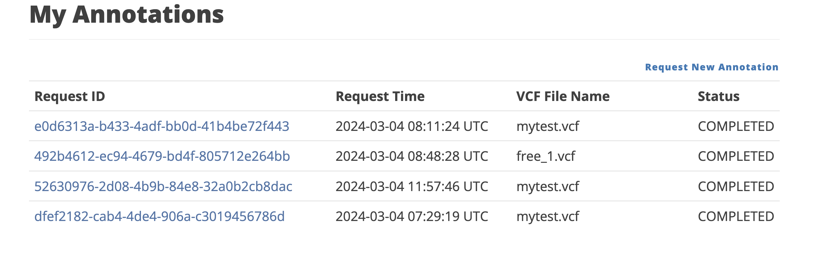
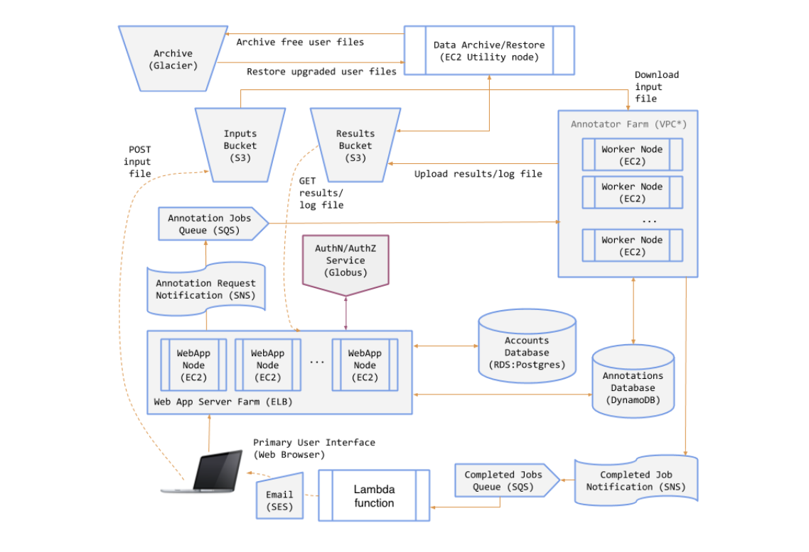
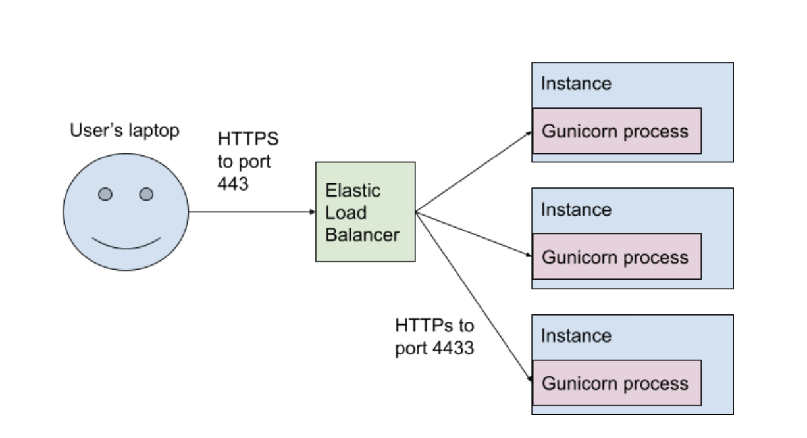

# MPCS Cloud Computing Final-Project: GAS Web Annotator

## Introduction

For the final project of the cloud computing class in the MPCS program, we implemented a web application utilizing AWS services. The users are able to submit annotation jobs from the web page which will be processed in our servers and made available to download later on. Data data will be stored within our AWS S3 Database for each user. We used the Python Flask and GUnicorn modules to deploy the web server while also utilizing Python boto3 library to carry out some operations of accessing our AWS resources.

In the complete product you are able to access a list of your annotation jobs from a page like below and see the data and download them.

## System Break Down

We will give a break down of the important components of this project. The entire structure of our application can be seen in the following image.

### 1. Web Server - /web

The user can access our web server online and create an account for themselves. Once the users have an account they are able to browse previous jobs, submit new jobs, or download files from jobs. The web server is managed by a load balancer which autoscales the number of web server instances in our AWS EC2 service. Once the job is submitted, the data for the job is stored in our AWS dynamo database and a series of operations described below are triggered.

### 2. Annotator - /ann

We also have multiple servers running our annotator which carries out the actual annotation job based on the submitted files from the user. This component is also managed by a load balancer which auto scales based on the total load. Once the user submits a job, the web server sends out an AWS SNS topic which is caught by the AWS SQS queue. The annotator reads the messages from the SQS queue and downloads the appropriate input files and completes the annotation job on them. Once the job is complete, the annotatation server uploads the product files into a S3 bucket which is downloadable from the user. In addition to the core functionality, once the job is complete, the annotator job submits a SNS topic which triggers an AWS lambda function which sends out a email to the user notifying them that their job is complete.

### 3. Storage - /util

As we mentioned before, multiple files will be downloadable from the user side in this application. To store these files, we have multiple buckets in the S3 service of AWS. The S3 buckests store the user input files and the result annotation files. We can generate a presigned URL for the users to download their files. While this functionality is nice, storage can be pretty expensive in the long run. in our application, we have implemented a free/premium user system where free users can only access their files up to a certain time period. Once the time has passed the free user will have to upgrade thier account to a premium in order to be able to access certain files. In relation to this system, we implemented a storage structure where we store the results files in the s3 bucket for that certain time period but move them over to a cheaper storage system, S3 Glacier after that time period. Again we utilized a SNS/SQS message system to trigger the code that archives the user files into glacier. When the user does upgrade to a premium account, we fetch the job data from the dynamo database and initiate a job that restores the files from Glacier (which can take quite a while...).
